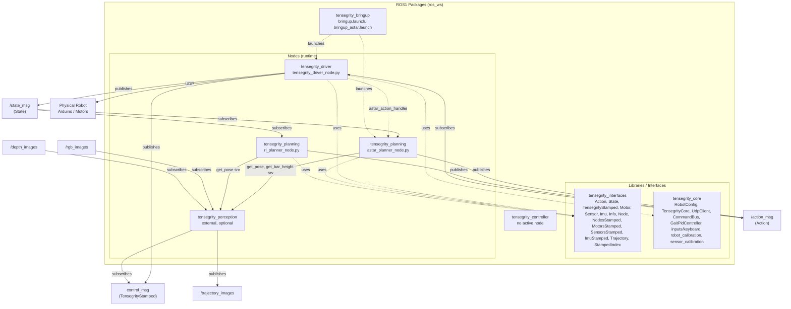

# ROS1 Package Interactions Diagram

This diagram shows how ROS1 packages and nodes interact via topics and services in **ros_ws** (current project status).

**To view the diagram:** Open `INTERACTIONS_DIAGRAM.html` in a web browser (double-click the file or drag it into Chrome/Firefox). The chart will render there.

## Current ros_ws packages

| Package | Location | Role |
|---------|----------|------|
| **tensegrity_interfaces** | `ros_ws/src/tensegrity_interfaces/` | All ROS message definitions (msgs only; no .srv in this workspace). |
| **tensegrity_core** | `ros_ws/src/tensegrity_core/` | ROS-free core: UDP client, state machine, gait PID, calibration. |
| **tensegrity_driver** | `ros_ws/src/tensegrity_driver/` | Single ROS node talking to robot over UDP; uses core + interfaces. |
| **tensegrity_planning** | `ros_ws/src/tensegrity_planning/` | A* and RL planner nodes; optional dependency on external perception. |
| **tensegrity_bringup** | `ros_ws/src/tensegrity_bringup/` | Launch files only (driver, or driver + A* planner). |
| **tensegrity_controller** | `ros_ws/src/tensegrity_controller/` | Present; no active node. |
| **tensegrity_perception** | *not in ros_ws* | External/optional; provides services used by planning when running. |

## Mermaid diagram

## Legend

- **Solid arrows**: topic publish/subscribe or service calls
- **Dotted arrows**: package dependency (build/use, launch, or optional use of code from another package)

## Summary

| Package | Role | Topics / Services |
|---------|------|-------------------|
| **tensegrity_interfaces** | All message types for driver and planning | **Msgs:** Action, State, TensegrityStamped, Motor, Sensor, Imu, Info, Node, NodesStamped, MotorsStamped, SensorsStamped, ImuStamped, Trajectory, StampedIndex. No .srv in this workspace. |
| **tensegrity_core** | ROS-free core; used by driver | **Components:** RobotConfig, TensegrityCore, UdpClient, CommandBus, GaitPidController, keyboard inputs, robot_calibration, sensor_calibration. **Hardware:** UDP to Arduino/motors. |
| **tensegrity_driver** | Single node: robot over UDP, gait controller | **Publishes:** `control_msg` (TensegrityStamped), `/state_msg` (State). **Subscribes:** `/action_msg` (Action). **UDP** to physical robot. Uses **astar_action_handler** from tensegrity_planning when Action has endcaps. **Scripts:** `tensegrity_driver_node.py`, `tensegrity_driver_cali_node.py`. |
| **tensegrity_planning** | A* and RL planner nodes | **Subscribes:** `/state_msg`. **Publishes:** `/action_msg`. **Calls (when perception running):** `get_pose` (both), `get_bar_height` (A*). **Scripts:** `astar_planner_node.py`, `rl_planner_node.py` (entry points); logic in `planner_astar.py`, `rl_planner.py`, `astar_action_handler.py`. |
| **tensegrity_perception** | Pose/tracking (external; not in ros_ws) | **Services:** `get_pose`, `init_tracker`, `get_bar_height`. **Subscribes:** `control_msg`, `/rgb_images`, `/depth_images`. **Publishes:** `/trajectory_images`. Used by planning at runtime when available. |
| **tensegrity_bringup** | Launch only | **Launches:** `bringup.launch` (driver only), `bringup_astar.launch` (driver + astar_planner). |
| **tensegrity_controller** | Package present | No active node. |

## Data flow

1. **Driver** talks to the **physical robot** over **UDP**. It publishes State on `/state_msg` and TensegrityStamped on `control_msg`, and subscribes to `/action_msg`. When Action includes endcaps, it uses **astar_action_handler** (from tensegrity_planning) to compute gait transform and ranges.
2. **Planners** (A* or RL) subscribe to `/state_msg`, optionally call **get_pose** (and A* may call **get_bar_height**) from **tensegrity_perception** if that stack is running, and publish Action on `/action_msg`.
3. **Perception** is optional and not built in ros_ws; when run elsewhere, it subscribes to `control_msg`, `/rgb_images`, `/depth_images`, and provides the services above for planners.

---

*Render the Mermaid block in GitHub, GitLab, VS Code (Mermaid extension), or [mermaid.live](https://mermaid.live).*
